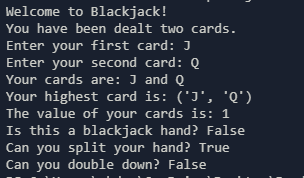

simple functions that help in calculating the value of a specific blackjack hand. you can download the source code from the github release and run the `main.py` file to use the functions using the cli.

